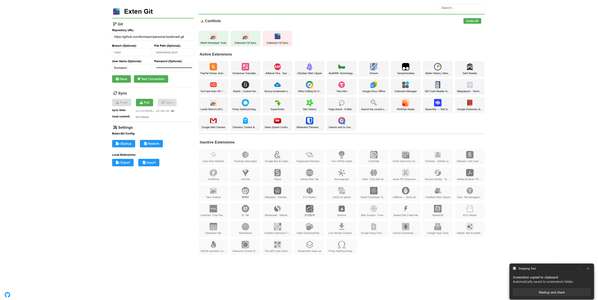

# exten-git

[exten-git](https://github.com/formaxcn/exten-git) is a Chrome extension that allows you to synchronize your Chrome extensions with a Git repository. This tool helps you keep track of your installed extensions and easily replicate your setup across multiple accounts.

## Features

- **Sync Chrome Extensions**: Automatically track and synchronize your Chrome extensions with a Git repository
- **Backup & Restore**: Backup your extension list to a Git repository and restore it on other machines
- **Automatic Sync**: Configure automatic synchronization at custom intervals
- **Manual Operations**: Push and pull extension data manually when needed
- **Extension Management**: View, search, and manage your installed extensions
- **Git Integration**: Full Git support including commits, branches, and remote repositories

## Installation

There are three ways to install this extension:

### 1. Local Installation (Development)
1. Clone or download this repository
2. Open Chrome and navigate to `chrome://extensions/`
3. Enable "Developer mode" in the top right corner
4. Click "Load unpacked" and select the project directory

### 2. CRX Package Installation
1. Download the CRX package from the [Releases](https://github.com/formaxcn/exten-git/releases) page
2. Open Chrome and navigate to `chrome://extensions/`
3. Enable "Developer mode" in the top right corner
4. Drag and drop the downloaded CRX file onto the extensions page

### 3. Chrome Web Store Installation
The extension is not yet available on the Chrome Web Store. Please stay tuned for updates!

## Configuration

1. After installing the extension, click on the extension icon to open the options page
2. Configure your Git repository settings:
   - Repository URL
   - Branch name (default: main)
   - File path for extensions data (default: extensions.json)
   - Authentication credentials (if required)
3. Set your preferred sync interval
4. Test the connection to ensure everything is set up correctly

## Usage

- **View Extensions**: See a list of all installed extensions in the options page
- **Search Extensions**: Use the search bar to quickly find specific extensions
- **Sync Data**: Manually sync your extensions data to Git using the sync button
- **Automatic Sync**: Enable automatic synchronization at your preferred interval
- **Import/Export**: Import or export extension data as needed

## Technical Details

This extension uses:
- LightningFS for in-browser file system operations
- isomorphic-git for Git operations directly in the browser
- Chrome Extension APIs for managing and tracking installed extensions

## Permissions

This extension requires the following permissions:
- `management`: To list and manage Chrome extensions
- `storage`: To store settings and extension data locally
- `declarativeNetRequest`: To handle network requests for Git operations
- `<all_urls>`: To access Git repositories hosted on any domain

## Development

To modify or contribute to this extension:

1. Clone the repository
2. Make your changes
3. Load the unpacked extension in Chrome
4. Test your changes

## Roadmap

Planned features and improvements:

- **Scheduled Synchronization**: Implement more robust scheduled synchronization capabilities
- **Browser Sync Settings**: Utilize browser's built-in sync functionality for storing settings across devices

## Privacy declarative NetRequest: 
### host permission: 
- https://*/* , http://*/* (optional): Only requested dynamically via chrome.permissions.request when the user manually configures a custom Git server for syncing to a self-hosted repository. Users must explicitly grant permission and can revoke it at any time.

### management: 
Uses chrome.management.getAll() to read the ID, name, and version of installed extensions in order to generate the synchronized JSON manifest. It does not install, uninstall, enable, disable, or modify any extensions.

### remote code: 
This extension does not load or execute any remote code. All scripts are bundled locally within the extension package.

### storage: 
Uses chrome.storage.local to store:
• User-entered Git repository URL and personal access token (PAT)
• Sync toggle state
• Last sync timestamp
• Local cache of the extension manifest
All data is stored locally on the user’s device only and can be cleared at any time via extension settings.

### Single purpose: 
The sole purpose of this extension is to synchronize the user’s currently installed Chrome extensions with a Git repository, enabling sharing of the same extension set across multiple devices and accounts.

## License

This project is licensed under the MIT License - see the [LICENSE](LICENSE) file for details.