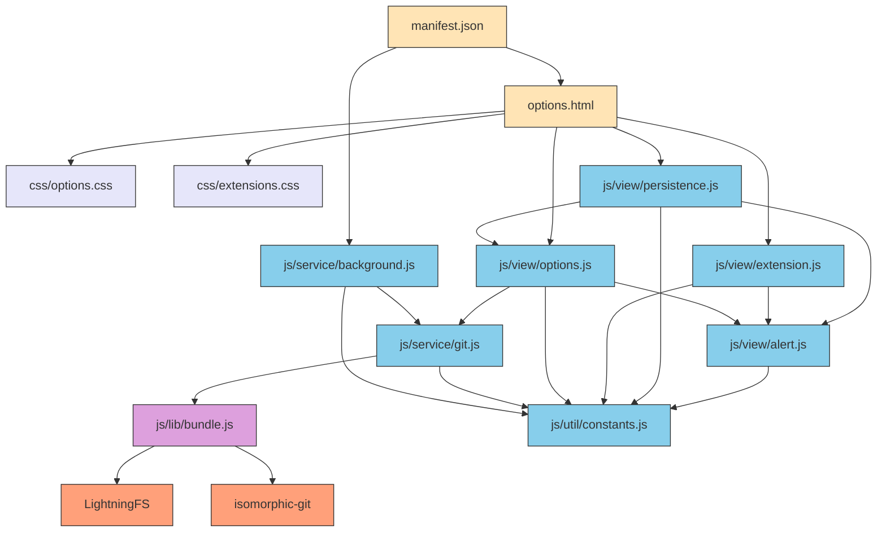

# Exten-Git Dependency Graph

```mermaid
graph TD
    %% --------------------------
    %% 顶层：Manifest
    %% --------------------------
    manifest.json --> options.html
    manifest.json --> js/service/background.js

    %% --------------------------
    %% 页面层（HTML + CSS）
    %% --------------------------
    options.html --> css/options.css
    options.html --> css/extensions.css
    options.html --> js/view/options.js
    options.html --> js/view/extension.js
    options.html --> js/view/persistence.js

    %% --------------------------
    %% 视图层 View
    %% --------------------------
    js/view/persistence.js --> js/view/alert.js
    js/view/extension.js --> js/view/alert.js
    js/view/options.js --> js/view/alert.js

    js/view/persistence.js --> js/view/options.js

    js/view/options.js --> js/service/git.js

    %% --------------------------
    %% 服务层 Service
    %% --------------------------
    js/service/background.js --> js/service/git.js
    js/service/git.js --> js/lib/bundle.js

    %% --------------------------
    %% 库层 Library
    %% --------------------------
    js/lib/bundle.js --> LightningFS
    js/lib/bundle.js --> isomorphic-git

    %% --------------------------
    %% 工具层 Utils（放到最底部）
    %% --------------------------
    js/view/alert.js --> js/util/constants.js
    js/view/persistence.js --> js/util/constants.js
    js/view/extension.js --> js/util/constants.js
    js/view/options.js --> js/util/constants.js
    js/service/git.js --> js/util/constants.js
    js/service/background.js --> js/util/constants.js

    %% --------------------------
    %% 样式定义
    %% --------------------------
    classDef htmlFiles fill:#FFE4B5,stroke:#333;
    classDef cssFiles fill:#E6E6FA,stroke:#333;
    classDef jsFiles fill:#87CEEB,stroke:#333;
    classDef libFiles fill:#DDA0DD,stroke:#333;
    classDef thirdParty fill:#FFA07A,stroke:#333;

    class options.html,manifest.json htmlFiles
    class css/options.css,css/extensions.css cssFiles
    class js/util/constants.js,js/view/alert.js,js/view/persistence.js,js/view/extension.js,js/view/options.js,js/service/background.js,js/service/git.js jsFiles
    class js/lib/bundle.js libFiles
    class LightningFS,isomorphic-git thirdParty

```